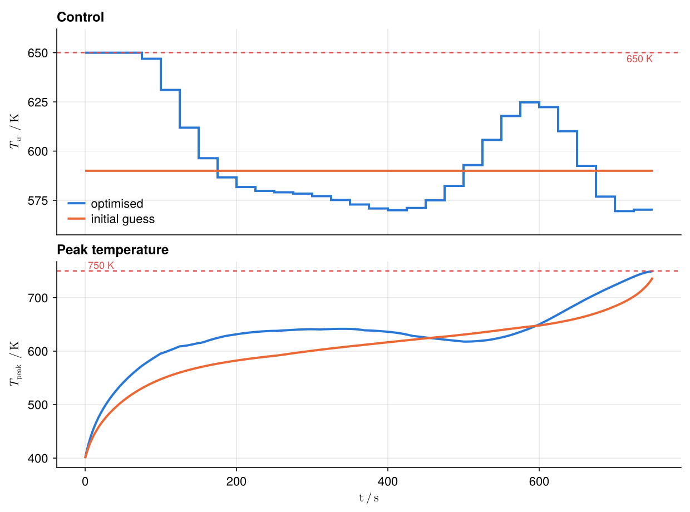
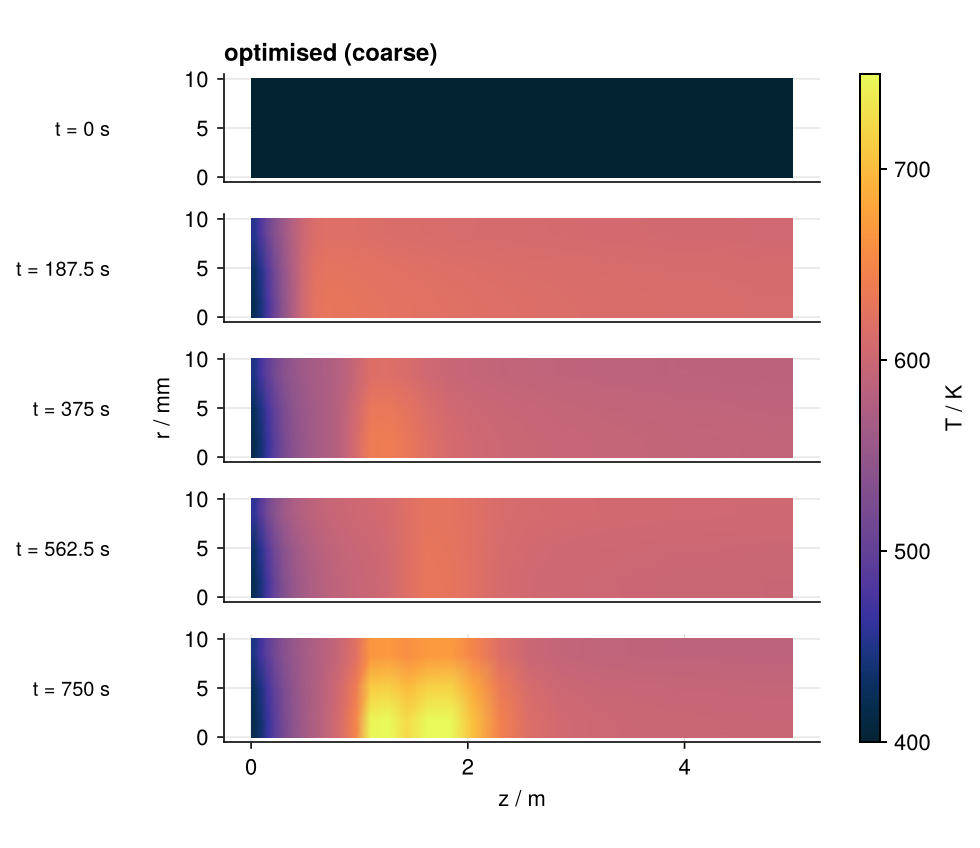

# PDEOpt

Dynamic optimization of distributed parameter reactive transport processes using direct transcription. FVM and Radau IIA for spatial and temporal discretization. 
Possible application examples include 
- Tubular reactors (plug-flow, fixed-bed, multi-phase, ...)
- Adsorption/Absorption columns
- Simulated Moving Bed Chromatography

## Example: CO₂ Methanation

<p align="center">
  
  
</p>

Two-dimensional pseudo-homogeneous fixed bed, cylindrical and radially symmetric in
$`(z,r)`$, axial advection only (no axial dispersion), cooling wall at $`r = R`$. State
$`(\rho_i, T)`$ with $`i \in \{\mathrm{CH_4, CO, CO_2, H_2O, H_2, N_2}\}`$, Xu–Froment LHHW
kinetics for three reactions.

$$\varepsilon\partial_t \rho_i+ v_z\partial_z \rho_i = \frac{1}{r}\partial_r\big(rD^{\text{eff}}_{r,i}\partial_r \rho_i\big) + (1-\varepsilon)M_i \sum_j \nu_{i,j} r_j(\rho, T)$$

$$(\rho c_p)^{\text{eff}}\partial_t T + \rho c_{p,\text{gas}}v_z\partial_z T = \frac{1}{r}\partial_r\big(r\lambda^{\text{eff}}_r\partial_r T\big) - (1-\varepsilon) \sum_j \Delta H_j r_j(\rho, T)$$

with ideal-gas pressure $`p = \sum_i (\rho_i/M_i)RT`$ and the wall condition
$`-\lambda^{\text{eff}}_r\partial_r T|_{r=R} = k_w(T - T_w(t))`$.

Every transport coefficient ($`D^{\text{eff}}_{r,i}`$, $`\lambda^{\text{eff}}_r`$,
$`(\rho c_p)^{\text{eff}}`$) depends on the state.

### Method

Spatial discretization gives the quasi-linear implicit ODE system

$$M(y)\dot y = -K(y)y + r(y) + b(t,u),$$

with $`M`$ diagonal, $`K`$ the transport operator, $`r`$ the reaction source, and $`b`$ affine in
the control.

| | |
|---|---|
| Spatial scheme | Cell-centred FVM, upwind advection with van Albada limiter, central radial diffusion |
| Temporal scheme | Radau IIA, $`s=3`$ stages |
| Transcription | Full-space / simultaneous |
| Solver | IPOPT with HSL MA97 (optional) |
| Derivatives | Analytic objective gradient, sparse AD Jacobian, limited-memory Hessian |
| Cost function | Maximize average CO₂ conversion over $`[0,t_f]`$
| Path constraint | $`T \le T_{\max}`$ at collocation nodes |

## Usage

Requires Julia 1.10 or newer.

```bash
julia --project -e 'using Pkg; Pkg.instantiate()'
```

Run the methanation optimal control problem:

```bash
julia --project apps/optimal_control/MethanationOpt.jl
```

### Docker

[`docker/Dockerfile`](docker/Dockerfile) builds an image with the Julia env
precompiled and HSL linked.

```bash
docker build -f docker/Dockerfile -t pdeopt:0.1 \
  --build-context hsl=/path/to/HSL_jll.jl.v2025.7.21 \
  --build-arg JULIA_CPU_TARGET=native .
```

```bash
docker/run.sh # methanation OCP
docker/run.sh apps/forward_solvers/Methanation.jl # other driver
DETACH=1 NAME=meth-01 docker/run.sh # long run
```

## Layout

| path | contents |
|---|---|
| [`src/mesh/`](src/mesh/) | Structured cylindrical grid, geometry, face sets, DOF map, sparsity patterns |
| [`src/models/`](src/models/) | Physics per model -> kinetics, property kernels, boundary data |
| [`src/properties/`](src/properties/) | Transport and thermodynamic correlations |
| [`src/problem/`](src/problem/) | `ProblemCache` |
| [`src/assembly/`](src/assembly/) | Global assembly and local kernels (FVM, DG using Ferrite.jl) |
| [`src/timestepping/`](src/timestepping/) | Crank–Nicolson, Radau IIA, dense output |
| [`src/solvers/`](src/solvers/) | Newton, chord, Shamanskii |
| [`src/optimization/`](src/optimization/) | NLP transcription, scaling, initial guesses |
| [`src/io/`](src/io/) | VTK/CSV writers, `.vtr`/`.pvd` reader for post-processing |
| [`src/diagnostics/`](src/diagnostics/) | Memory sampling, IPOPT log |
| [`apps/`](apps/) | Driver scripts -> forward simulation, optimal control, figures |

## References

The CO₂ methanation model is taken from (slightly modified):

- J. Bremer, K. H. G. Rätze, K. Sundmacher, *CO₂ methanation: Optimal start-up control of a
  fixed-bed reactor for power-to-gas applications*, AIChE Journal 63 (2017) 23–31.
- J. Xu, G. F. Froment, *Methane steam reforming, methanation and water-gas shift: I.
  Intrinsic kinetics*, AIChE Journal 35 (1989) 88–96.

## License

Released under the [MIT License](LICENSE).